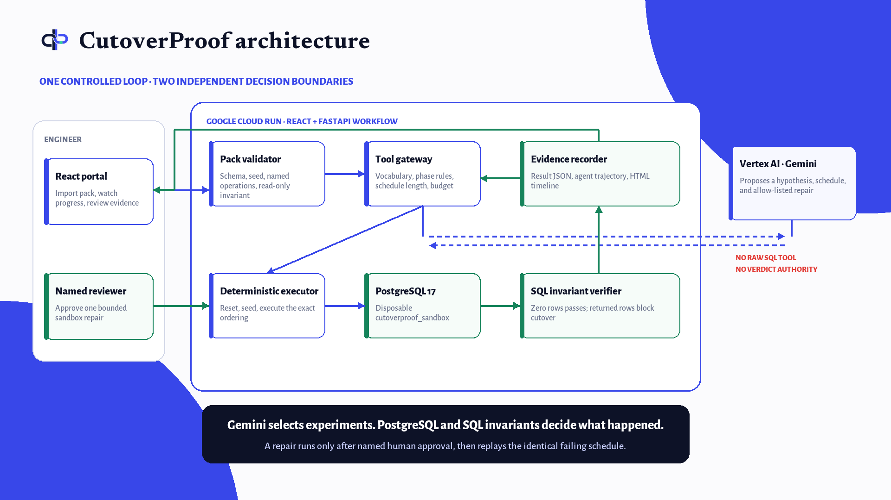

# CutoverProof

**An adversarial temporal-safety lab for PostgreSQL expand-and-contract migrations.**

> Migration tools verify steps. Failures live in schedules.

CutoverProof helps backend and data-platform engineers test the compatibility window of an online migration. A specialised agent proposes short operation orderings; a controlled harness resets a disposable PostgreSQL database, executes only declared operations, and decides pass/fail with independent SQL invariants. The model proposes experiments—it never supplies the verdict.

**Live product:** [cutoverproof-1021060138341.us-central1.run.app](https://cutoverproof-1021060138341.us-central1.run.app)

This is a bounded, synthetic hackathon testbed. It does not ingest arbitrary production migrations and it does not prove a migration safe.

## Audited result

The checked-in benchmark uses five scenarios, seed 42, an equal maximum of four candidate executions, and `gemini-3.1-flash-lite` for both model approaches.

| Approach | Unsafe recall | Safe false alarms | Mean unsafe search effort* | Model calls | Invalid runs |
|---|---:|---:|---:|---:|---:|
| A3 specialised iterative agent | **3/3** | **0/2** | **1.00** | 15 | 0 |
| A1 one-shot same-model baseline | 2/3 | 0/2 | 2.33 | 5 | 0 |
| A2 seeded heuristic explorer | 3/3 | 0/2 | 3.00 | 0 | 0 |

\* A verified find costs its candidate index; a valid miss costs `budget + 1`. This prevents an approach that finds one easy case and misses the rest from appearing artificially efficient.

Raw aggregate: [`artifacts/evaluation/benchmark_results.json`](artifacts/evaluation/benchmark_results.json). Per-run JSON, trajectories, and self-contained HTML timelines live under [`artifacts/`](artifacts/). Failed and stale experimental runs are retained under [`artifacts/invalidated/`](artifacts/invalidated/) and are excluded from the table.

No API-price claim is made: model calls and token counts are recorded, but this implementation does not calculate provider pricing.

## End-to-end flow

1. The agent sees phase descriptions, declared operation IDs, invariant descriptions, and its remaining budget. Evaluator labels and known failing schedules are withheld.
2. It proposes one ordered schedule and a concrete hypothesis.
3. The gateway validates the schedule and spends one candidate from the shared budget.
4. PostgreSQL is reset, seeded, and executes the named operations sequentially to simulate a temporal interleaving.
5. At the schedule-end verification boundary, SQL assertions return zero rows for pass or violating rows for fail.
6. A verified failure may produce one allow-listed repair proposal. Replay requires the explicit `--approve-repair` flag and uses the exact failing schedule.

The audited U1 demo produces a verified status mismatch after `expand_schema → backfill_orders → legacy_order_update_shipped`, then passes the identical replay after an approved compatibility-trigger repair.



Gemini proposes hypotheses and schedules; the guarded gateway, PostgreSQL executor, and SQL verifier retain authority over execution and verdicts. See [`docs/ARCHITECTURE.md`](docs/ARCHITECTURE.md) for the trust boundaries and deployed topology.

## Reproduce

Tested in the local lab with Python 3.12.13, Docker 29.4.0, and PostgreSQL 16.15. Python 3.11 is also within the declared package range.

```powershell
python -m venv .venv
.\.venv\Scripts\Activate.ps1
python -m pip install -r requirements.txt

docker compose up -d
python -m src.coordinator.cli test-db
```

Set one model key in the current shell; do not put its value in the repository:

```powershell
$env:GEMINI_API_KEY = "your-key"
```

Run the short U1 sample, including explicit sandbox-repair approval:

```powershell
python -m src.coordinator.cli run `
  --scenario u1_status_trigger_race `
  --approach specialised_agent `
  --budget 4 `
  --seed 42 `
  --model gemini-3.1-flash-lite `
  --approve-repair
```

### Use the customer portal

Build the React client once, then start the FastAPI product server:

```powershell
cd web
pnpm install --frozen-lockfile
pnpm build
cd ..
$env:CUTOVERPROOF_DEMO_EMAIL="engineer@cutoverproof.dev"
$env:CUTOVERPROOF_DEMO_PASSWORD="choose-a-shareable-demo-password"
python -m src.api.app
```

Use the [live Cloud Run product](https://cutoverproof-1021060138341.us-central1.run.app), or open `http://127.0.0.1:8766` after starting the server locally. From the portal a backend engineer can:

1. sign in to the migration-safety workspace;
2. take a four-step coach-mark tour of the real interface without creating fake run history;
3. choose **New assessment** to inspect the built-in example contract as formatted JSON or import a validated JSON migration pack;
4. watch the bounded agent assessment run in the background;
5. read the cutover decision and plain-language finding;
6. inspect the executed ordering and violating database rows in-app;
7. approve an allow-listed sandbox repair by name;
8. verify the repair against the identical failing schedule; and
9. reopen assessment history; and
10. set the default candidate budget and evidence-opening preference from a responsive Settings page.

The custom-pack template is available in-app and at [`examples/custom_assessment_pack.json`](examples/custom_assessment_pack.json). It accepts schema SQL, seed SQL, declared operations, and read-only SQL invariants. Server-level commands are rejected and every candidate still executes only against the dedicated disposable database identity.

The customer portal is responsive from a 320 px small-phone viewport through laptop and desktop widths. Navigation collapses to labelled icon controls, assessment actions stack, and result/evidence views reflow without document-level horizontal overflow.

Internal benchmark approaches and scores deliberately do not appear in the customer interface. They remain in the reproducible evaluation artifacts below.

Run the complete equal-budget matrix:

```powershell
python -m src.coordinator.cli evaluate `
  --budget 4 `
  --seed 42 `
  --model gemini-3.1-flash-lite
```

If a provider timeout or quota limit interrupts a cell, preserve completed work and rerun only invalid or stale cells:

```powershell
python -m src.coordinator.cli evaluate `
  --budget 4 `
  --seed 42 `
  --model gemini-3.1-flash-lite `
  --resume
```

Free-tier quotas can change and retries consume provider requests. Running the entire matrix may need a billed key; U1 is the short live demo. The deterministic tests do not call a model:

```powershell
python -m pytest tests -q
```

Expected audited result: `38 passed`.

The React checks are independent of the Python suite:

```powershell
cd web
pnpm test -- --run
pnpm build
```

## Safety and evidence boundaries

- Destructive reset is refused unless the target is the allow-listed local `cutoverproof_sandbox` database using the `cutover` user.
- The agent receives no shell, filesystem mutation, network, or arbitrary-SQL tool.
- Scenario and referenced SQL paths must resolve below `scenarios/`.
- Provider failures, verifier failures, execution failures, and malformed outputs cannot count as counterexamples or safe results.
- Invalid benchmark cells make recall/false-alarm metrics `INVALID`; they are not converted to misses.
- Repair SQL is checked in and allow-listed. The model selects and explains a template; it does not write arbitrary repair SQL.
- The HTML timeline contains embedded CSS and is generated solely from the verified trace.
- Secret-like values are sanitized before evidence is written.

## Repository map

```text
scenarios/                 3 unsafe fixtures and 2 safe controls
src/agent/                 live-model adapter, A1/A2/A3 approaches, tool gateway
src/executor/              guarded PostgreSQL reset and deterministic executor
src/verifier/              SQL invariant verifier
src/repair/                approval gate and identical-schedule replay
src/evidence/              sanitized run and trajectory artifacts
src/report/                self-contained HTML timeline
src/coordinator/           run/evaluate/resume CLI
src/api/                   FastAPI customer workflow and validated contracts
web/                       React customer portal and browser-facing tests
tests/                     model-free deterministic and security regressions
artifacts/                 current valid evidence plus invalidated run archive
docs/                      architecture, benchmark, changelog, demo, and audit
```

## Important limitations

- Scenarios are structured synthetic fixtures; there is no parser for arbitrary migration repositories.
- Interleavings are deterministic sequential schedules, not thread-level or distributed concurrency simulation.
- Invariants run at the configured schedule-end boundary in the current fixtures.
- A safe-control result means only “no counterexample found within the tested candidate budget.”
- Model seeds are best-effort; database and verifier outcomes are deterministic, model text is not guaranteed bit-for-bit reproducible.

See [`docs/IMPROVEMENT-CHANGELOG.md`](docs/IMPROVEMENT-CHANGELOG.md), [`docs/BENCHMARK-RESULTS.md`](docs/BENCHMARK-RESULTS.md), [`docs/DEMO-SCRIPT.md`](docs/DEMO-SCRIPT.md), [`docs/TOOLS-AND-PROVENANCE.md`](docs/TOOLS-AND-PROVENANCE.md), and [`docs/AUDIT-REPORT.md`](docs/AUDIT-REPORT.md).

For the single-container Cloud Run demo—with an ephemeral PostgreSQL sandbox inside the instance and Vertex AI authentication through a least-privilege service identity—see [`docs/CLOUD-RUN.md`](docs/CLOUD-RUN.md). The submission-ready synopsis, judge path, and video upload copy are under [`submission/`](submission/).

## Provenance and licence

The CutoverProof application, fixtures, tests, and evidence pipeline were created for this competition. Reused components are the pinned open-source Python packages in `requirements.txt` and the official PostgreSQL Docker image. CutoverProof is released under the [MIT License](LICENSE); dependencies retain their own licences.
