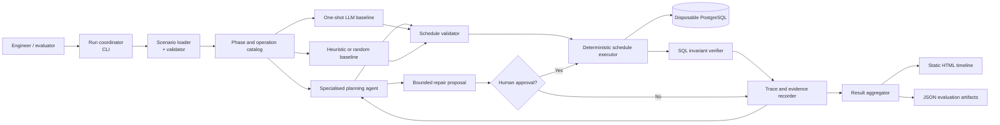
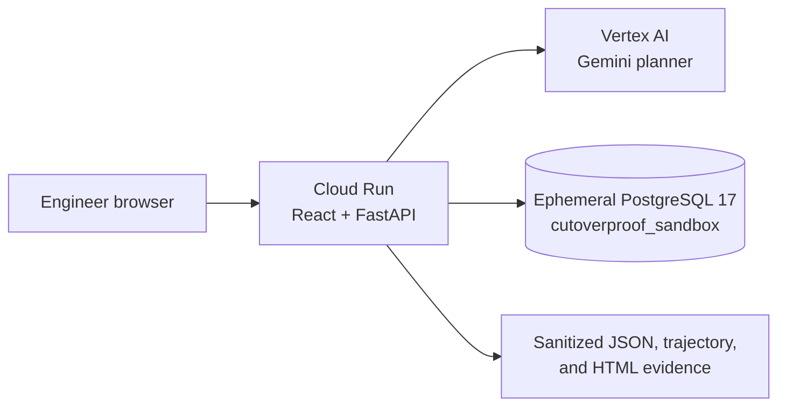
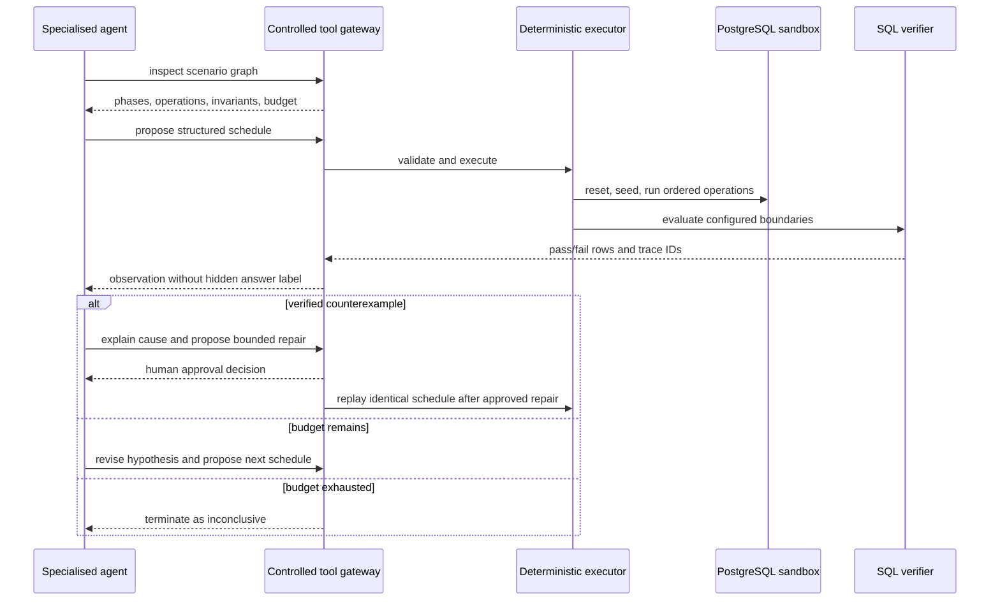

# CutoverProof Architecture

## Requirements summary

### Functional

- Load a checked-in synthetic migration scenario.
- Let a specialised agent select candidate temporal schedules.
- Execute schedules only through a deterministic PostgreSQL harness.
- Verify business invariants with SQL assertions.
- Preserve replayable evidence and agent trajectories.
- Compare the advanced approach with equal-budget baselines.
- Render the primary counterexample as a visual timeline.
- Permit only a bounded, human-approved repair and replay.

### Non-functional

- Clean-environment reproducibility takes precedence over extensibility.
- The primary demonstration should finish within five minutes after setup.
- Same-seed deterministic runs must yield identical invariant outcomes.
- Synthetic data and a disposable database are mandatory.
- Agent outputs are proposals, never verdicts.
- Failures of infrastructure, parsing, or the verifier must not become false counterexamples.
- The architecture must be small enough to implement and document before the competition deadline.

### Constraints

- Individual hackathon submission.
- PostgreSQL only.
- One strong scenario family rather than general migration ingestion.
- No production integrations.
- No application code existed in this handoff; the coding agent must disclose all generated and reused components.
- All four submission artifacts remain mandatory: code/changelog, reproduction guide, video, and trajectories.

## High-level architecture



The current fixtures define a phase/operation catalog, not a general dependency graph. The validator enforces declared operation IDs and schedule length; it does not infer arbitrary migration preconditions.

### Deployed demo topology



The deployed demo deliberately keeps its database ephemeral and colocated with the application. This makes destructive reset safe and keeps the demonstration self-contained. It is not the production scaling design: durable jobs, per-assessment database isolation, and object storage would be required before multi-tenant use.

## Agent loop



## Components

### 1. Run coordinator

Responsibilities:

- Select scenario, approach, seed, and budget.
- Start one isolated run at a time.
- Pass only permitted scenario facts to each approach.
- Aggregate artifacts and exit with a meaningful status.

It must not contain scenario-specific answers or silently retry failed evaluations.

### 2. Scenario loader and validator

Responsibilities:

- Load structured configuration and referenced SQL assets.
- Validate declared phases, named operations, invariants, and budgets.
- Keep evaluator-only labels separate from agent-visible input.
- Reject path traversal and undeclared file access.

The hackathon implementation should prefer a simple checked-in JSON format. A custom language is prohibited.

### 3. Phase and operation catalog

The checked-in catalog is a deterministic representation of:

- Migration phases and named operations.
- Old/new application operations.
- Backfill and compatibility operations.
- Human-readable operation semantics and actors.
- Schedule-end SQL invariants.

The agent uses this catalog to choose experiments. No graph database or inferred dependency engine is implemented.

### 4. Specialised planning agent

Responsibilities:

- Form a concrete failure hypothesis.
- Select declared operations and ordering constraints.
- Use observed traces to revise the next schedule.
- Stop on verified failure or budget exhaustion.
- Explain a verified cause using trace identifiers.
- Propose only a permitted repair.

The agent cannot run arbitrary SQL, shell commands, or edit application files.

### 5. Baselines

- **One-shot LLM:** same model and scenario facts, no iterative tool feedback; proposes up to the same schedule budget in one response.
- **Heuristic/random explorer:** deterministic code that selects valid schedules from declared operations without semantic LLM reasoning.

All approaches use the same validator, executor, verifier, and evidence recorder.

### 6. Schedule validator

Responsibilities:

- Enforce declared operation names.
- Enforce phase-transition constraints and maximum schedule length.
- Reject malformed or impossible schedules.
- Produce canonical schedule identifiers.

### 7. Deterministic executor

Responsibilities:

- Reset and seed PostgreSQL before each candidate.
- Execute operations in the requested order.
- Execute deterministic sequential schedules that simulate selected temporal interleavings.
- Record transaction boundaries and SQL outcomes.
- Invoke invariants at the schedule-end boundary used by the current fixtures.

This component decides what happened, never what it means semantically.

### 8. SQL invariant verifier

Responsibilities:

- Run declared read-only SQL assertions.
- Return pass/fail plus evidence rows.
- Treat assertion execution failure as verifier failure, not invariant failure.

The expected convention should be simple and documented, such as “assertion passes only when the query returns zero violating rows.”

### 9. Trace and evidence recorder

Minimum artifact fields:

- Run/scenario/approach identifiers.
- Code version when available.
- Model and prompt versions.
- Seed, budgets, and timestamps.
- Candidate schedules and validation outcomes.
- Database reset/seed status.
- Ordered operation outcomes.
- Invariant SQL identifier and evidence rows.
- Agent tool calls, responses, retries, and termination reason.
- Human approval event.
- Repair replay relationship to original run.

### 10. Evidence surfaces

Generate two views from the same verified run result:

- A customer portal that leads with the decision, plain-language finding, migration conflict, recommended action, approval, replay, and history.
- An in-app evidence modal showing the executed ordering and violating rows without exposing raw SQL by default.
- A self-contained HTML audit artifact with ordered operations, invariant boundary, and replay details for technical drill-down and offline verification.

### 11. Repair approval and replay

Repairs are constrained templates, not arbitrary generated patches. The agent chooses and explains a template; the human approves; the executor applies the associated checked-in sandbox variant and replays the same schedule.

This is a hackathon-safe demonstration of an end-to-end loop, not production change automation.

## Recommended minimal technology choices

| Concern | Recommendation | Rationale | Rejected alternative |
|---|---|---|---|
| Orchestration | Python 3.11+ CLI plus FastAPI workflow service | Reuses one deterministic core for automation and a usable product surface | Separate execution implementations would create evidence drift. |
| Database | PostgreSQL 16 in Docker Compose | Matches problem and provides clean isolation | Managed database harms reproducibility. |
| DB client | A maintained synchronous PostgreSQL driver | Deterministic and simple | ORM hides transaction behavior. |
| Configuration | Checked-in JSON | Standard library support and explicit validation | Custom DSL is scope risk. |
| Tests | pytest or equivalent existing test runner | Familiar and automatable | Bespoke runner adds risk. |
| Visual | React portal plus generated static HTML audit artifact | Gives engineers a usable decision workflow while retaining self-contained evidence | A raw artifact alone is too dense for the primary user journey. |
| Agent integration | Thin provider adapter around one available model | Keeps prompts/tools explicit | Large agent framework obscures the contribution. |
| Artifacts | JSON plus HTML | Machine-verifiable and human-readable | Model-generated prose alone is unauditable. |

The coding agent may choose equivalent libraries already installed, but it must record the choice and must not create extra services.

## Suggested implementation tree

```text
CutoverProof/
  README.md
  docker-compose.yml
  pyproject.toml or requirements.txt
  src/
    coordinator/
    scenarios/
    agent/
    executor/
    verifier/
    evidence/
    report/
    api/
  prompts/
  scenarios/
    status-trigger-race/
    controls/
  tests/
  web/
  artifacts/
    examples/
  docs/
    adr/
  specs/
```

This is a logical guide, not a demand for excessive modules. Fewer well-named files are acceptable.

## Security boundaries

- The database host and name must be allow-listed as the project sandbox.
- Agent-generated operation names must resolve to predefined functions or SQL assets.
- The agent must never receive a raw shell or arbitrary SQL execution tool.
- Scenario paths must resolve beneath the scenario directory.
- Environment secrets must not be serialized into trajectories.
- Human approval must be recorded before applying a repair variant.
- Docker volumes and containers must be scoped to the project and documented; cleanup must not target unrelated containers or data.

## Failure modes and mitigations

| Failure | Impact | Mitigation |
|---|---|---|
| Model unavailable | Advanced run cannot start | Fail clearly; preserve baseline capability; document required key and estimated cost. |
| Malformed agent schedule | Wasted budget or unsafe execution | Structured validation and narrow declared operations. |
| Nondeterministic database reset | Untrustworthy metrics | Fresh schema/database per candidate and reset tests. |
| Verifier SQL fails | False classification risk | Separate verifier-error state; exclude run from metrics. |
| Safe control flagged | Product credibility collapses | Include controls and report false-rejection rate. |
| Baseline receives less information | Inflated improvement | Central evaluation adapter supplies identical facts and budgets. |
| Timeline disagrees with raw trace | Misleading demo | Render solely from stored trace, never from LLM prose. |
| Agent proposes arbitrary patch | Security and reproducibility risk | Repair-template allow-list plus human approval. |
| Docker setup fails for judge | Qualification-gate failure | Test from a clean clone and pin versions. |

## Operational complexity

This submission should contain one database container and one local process. Additional queues, caches, API gateways, graph databases, observability stacks, or frontend build systems require explicit human approval and are presumed rejected.
